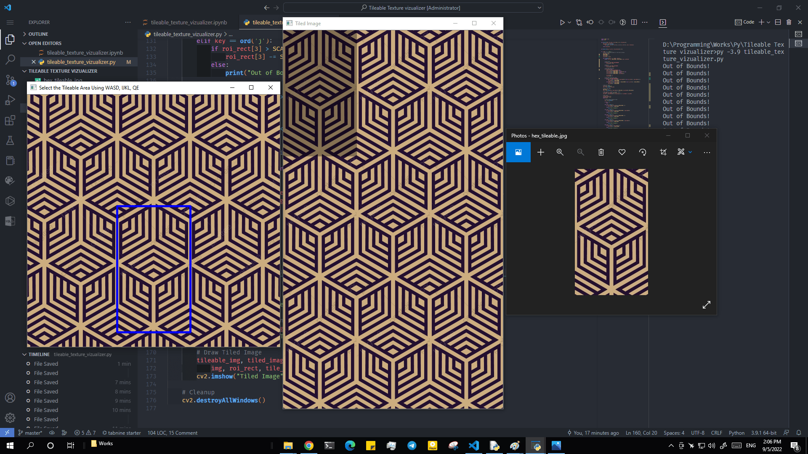
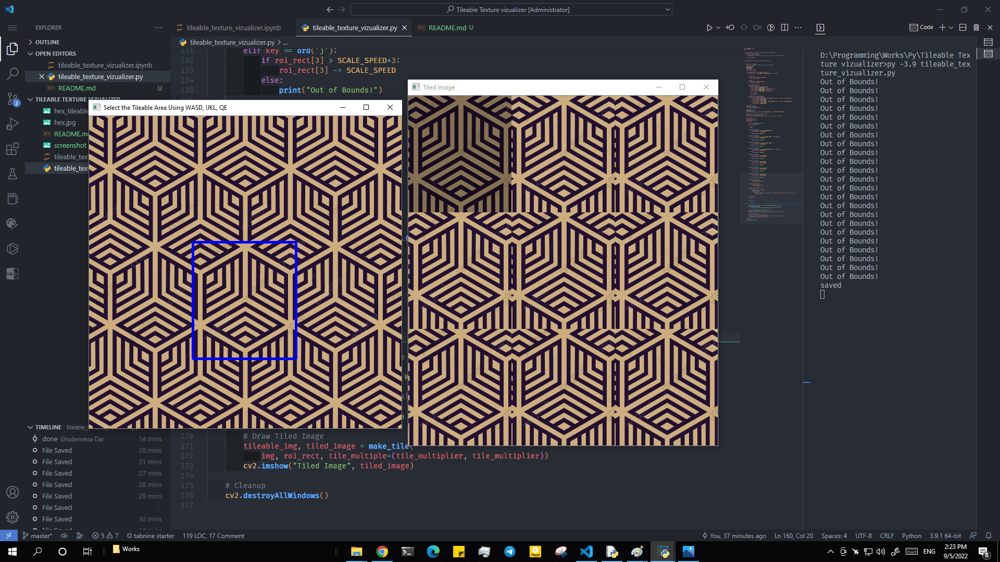

# Tileable Texture Visualizer and Extractor

A GUI app made using python and opencv to find the tileable part in Images/Textures.





## Requirements

- python 3
- numpy
- opencv for python

## How to run

```bash
python tileable_texture_vizualizer.py
```

## Keybinds

- **WASD** : Change the ROI center
- **IJKL** : Change the ROI size
- **Q,E** : Change the preview tile count
- **Mouse Drag** : Change the ROI center (faster)
- **Mouse Wheel** : Change the ROI size (proportional)
- **Enter** : Save the tileable image
- **ESC** : Quit
